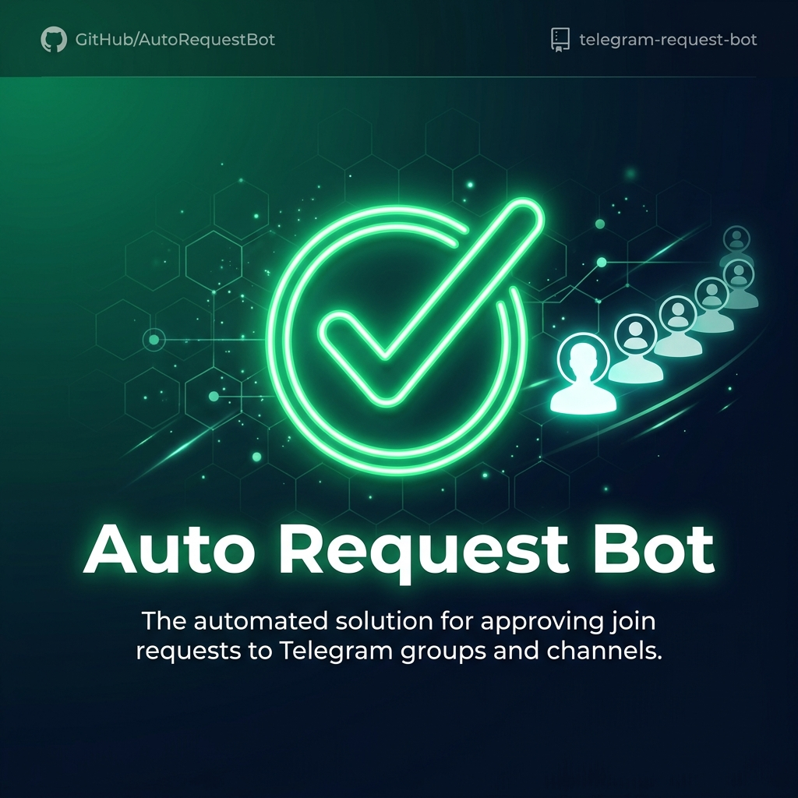

<p align="center">
  
</p>

<h1 align="center">✅ Telegram Auto Request Bot</h1>

<p align="center">
  <b>Auto-approve join requests for Telegram groups and channels with multiple modes</b>
</p>

<p align="center">
  <a href="#features">Features</a> •
  <a href="#deploy-to-heroku">Heroku</a> •
  <a href="#deploy-on-vps--rdp">VPS/RDP</a> •
  <a href="#docker">Docker</a> •
  <a href="#commands">Commands</a>
</p>

<p align="center">
  
  
  
  
  
</p>

---

## ✨ Features

| Feature | Description |
|---------|-------------|
| ✅ **Auto-Approve** | Automatically approve join requests in groups/channels |
| 🔑 **Telethon Login** | Users login via phone + OTP to approve bulk requests |
| 📊 **4 Approval Modes** | Immediate, Limit, Count-based, Time-scheduled |
| 🔐 **2FA Support** | Full two-factor authentication support |
| 📡 **Bulk Approve** | Approve all or N pending requests at once |
| 📢 **Force Join** | Optional channel subscription check |
| 🛡️ **Rate Limiter** | Built-in rate limiting to avoid Telegram bans |
| 💾 **Persistent Data** | JSON-based storage for users, sessions, groups |
| 📦 **Data Export** | Owner can export all data files |
| ⏱️ **Time-Based Mode** | Schedule approvals at specific IST times |

---

## 🔧 Prerequisites

| Item | Where to Get |
|------|-------------|
| `BOT_TOKEN` | [@BotFather](https://t.me/BotFather) on Telegram |
| `OWNER_ID` | Your Telegram user ID ([@userinfobot](https://t.me/userinfobot)) |
| `API_ID` | [my.telegram.org](https://my.telegram.org) → API Development |
| `API_HASH` | [my.telegram.org](https://my.telegram.org) → API Development |

> **Important:** The bot needs to be added as **admin** with "Invite via Link" permission in your group/channel.

---

## 🚀 Deploy to Heroku

[](https://heroku.com/deploy?template=https://github.com/MD-TECH-HACKER/Telegram-Auto-Request-Bot)

> Resources tab → disable `web` → enable `worker`.

---

## 🖥️ Deploy on VPS / RDP

```bash
git clone https://github.com/MD-TECH-HACKER/Telegram-Auto-Request-Bot.git
cd Telegram-Auto-Request-Bot
pip install -r requirements.txt
cp .env.example .env
nano .env   # Fill in your values
python bot.py
```

### Run in Background

```bash
screen -S autorequest
python bot.py
# Ctrl+A then D
```

---

## 🐳 Docker

```bash
git clone https://github.com/MD-TECH-HACKER/Telegram-Auto-Request-Bot.git
cd Telegram-Auto-Request-Bot
docker build -t auto-request-bot .
docker run -d --name auto-request-bot \
  -e BOT_TOKEN=your_token \
  -e OWNER_ID=123456789 \
  -e API_ID=12345 \
  -e API_HASH=your_hash \
  auto-request-bot
```

---

## 📋 Commands

### Private Commands

| Command | Description |
|---------|-------------|
| `/start` | Start the bot |
| `/cmds` | Show all commands |
| `/login` | Login via phone + OTP |
| `/logout` | Logout from account |
| `/cancel` | Cancel ongoing operation |
| `/export` | Export data files (Owner only) |

### Approval Commands

| Command | Description |
|---------|-------------|
| `/approve <chat_id>` | Show approval UI for a chat |
| `/approve all <chat_id>` | Approve ALL pending requests |
| `/approve count(N) <chat_id>` | Approve N pending requests |

### Group/Channel Commands (Admin Only)

| Command | Description |
|---------|-------------|
| `/set_mode immediate` | Approve everyone instantly |
| `/set_mode limit N` | Approve up to N users, then stop |
| `/set_mode count N` | Queue requests, approve when N reached |
| `/set_mode time HH:MM` | Approve queued at IST time |
| `/reset` | Reset all modes and counters |
| `/status` | Show current mode status |

---

## 🔐 Login Flow

1. Send `/login` → bot asks for phone number
2. Share phone or type in `+1234567890` format
3. Enter OTP code as `CODE_12345`
4. If 2FA enabled, enter password as `PASS_mypassword`
5. Session saved — use `/approve` commands

---

## ⚙️ Environment Variables

| Variable | Required | Description |
|----------|----------|-------------|
| `BOT_TOKEN` | ✅ | Bot token from BotFather |
| `OWNER_ID` | ✅ | Your Telegram user ID |
| `API_ID` | ✅ | Telegram API ID |
| `API_HASH` | ✅ | Telegram API Hash |
| `REQUIRED_CHANNEL` | ❌ | Channel with `@` for force join |

---

## 📁 Project Structure

```
Telegram-Auto-Request-Bot/
├── bot.py              # Main bot code
├── requirements.txt    # Dependencies
├── Procfile            # Heroku worker
├── runtime.txt         # Python version
├── Dockerfile          # Docker config
├── app.json            # Heroku deploy
├── .env.example        # Env template
├── .gitignore          # Git ignore
├── LICENSE             # MIT License
├── data/               # JSON data storage
│   ├── accepted_users.json
│   ├── groups.json
│   ├── limits.json
│   └── sessions.json
├── sessions/           # Telethon sessions
└── assets/
    └── banner.png      # Repo banner
```

---

## 📄 License

[MIT License](LICENSE)

---

<p align="center"><b>⭐ Star this repo if you found it useful!</b></p>
